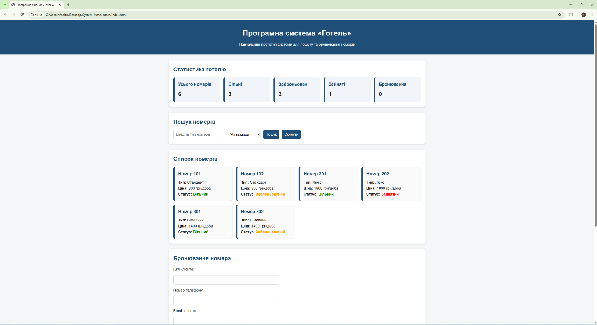
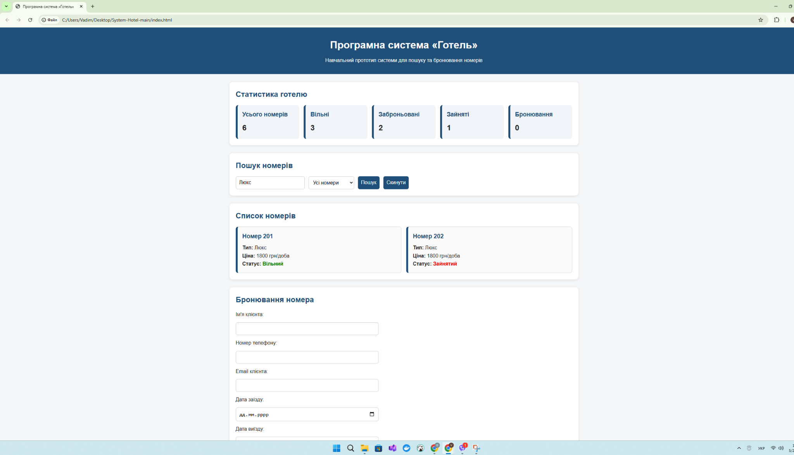
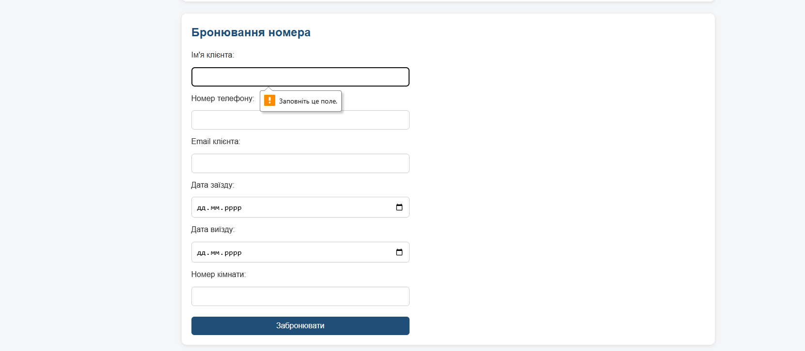
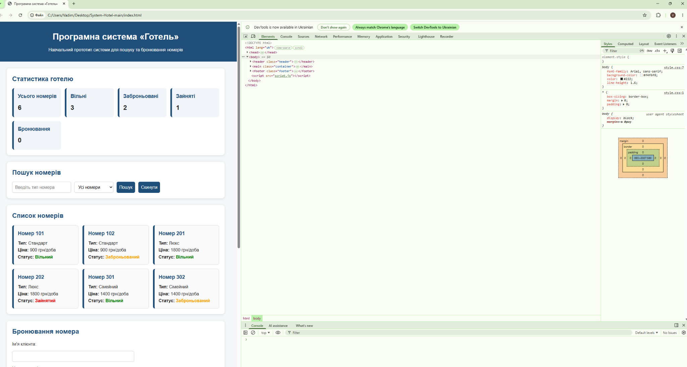
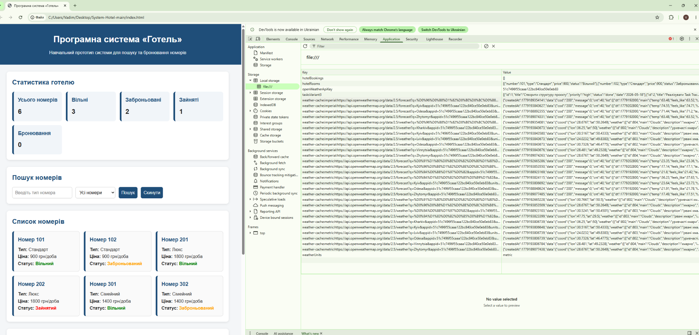

# Тестування програмної системи «Готель»

## 1. Мета тестування

Метою тестування є перевірка працездатності програмної системи «Готель», коректності обробки вхідних даних, правильності відображення вихідних даних та стабільності роботи основних функцій.

Тестування виконано з використанням методів чорного та білого ящика.

---

## 2. Тестування методом чорного ящика

Метод чорного ящика передбачає перевірку роботи системи з точки зору користувача без аналізу внутрішнього коду програми.

### TC-01. Перевірка головного інтерфейсу

**Вхідні дані:** відкриття файлу `index.html` у браузері.  
**Очікуваний результат:** система відображає головну сторінку, статистику готелю, пошук номерів, список номерів і форму бронювання.  
**Фактичний результат:** інтерфейс системи відображено коректно.  
**Статус:** пройдено.

---

### TC-02. Пошук номера за типом

**Вхідні дані:** у поле пошуку введено значення `Люкс`.  
**Очікуваний результат:** система відображає тільки номери типу «Люкс».  
**Фактичний результат:** після пошуку відображено номери типу «Люкс».  
**Статус:** пройдено.

---

### TC-03. Створення бронювання з коректними даними

**Вхідні дані:**

- ім’я клієнта: `Тестовий Клієнт`;
- телефон: `+380991112233`;
- email: `test@example.com`;
- номер: `301`;
- дата заїзду: `2026-05-21`;
- дата виїзду: `2026-05-25`.

**Очікуваний результат:** система створює бронювання та відображає його у списку бронювань.  
**Фактичний результат:** бронювання було створено та додано до списку.  
**Статус:** пройдено.

---

### TC-04. Спроба бронювання з порожніми полями

**Вхідні дані:** поля форми бронювання залишено порожніми.  
**Очікуваний результат:** система не дозволяє створити бронювання без обов’язкових даних.  
**Фактичний результат:** браузер показує повідомлення «Заповніть це поле».  
**Статус:** пройдено.

---

## 3. Тестування методом білого ящика

Метод білого ящика передбачає перевірку внутрішньої логіки роботи програмної системи, зокрема функцій JavaScript, обробників подій та роботи зі сховищем даних.

### WB-01. Перевірка відсутності помилок у консолі

**Об’єкт перевірки:** виконання JavaScript-коду після запуску системи.  
**Очікуваний результат:** у консолі браузера відсутні червоні помилки JavaScript.  
**Фактичний результат:** після відкриття системи помилки в консолі не відображаються.  
**Статус:** пройдено.

---

### WB-02. Перевірка збереження даних у LocalStorage

**Об’єкт перевірки:** локальне збереження даних системи.  
**Очікуваний результат:** у LocalStorage мають бути ключі, пов’язані з номерами та бронюваннями.  
**Фактичний результат:** у LocalStorage присутні ключі `hotelRooms` та `hotelBookings`.  
**Статус:** пройдено.

---

## 4. Підсумкова таблиця тестування

| № | Метод | Тест | Очікуваний результат | Статус |
|---|---|---|---|---|
| TC-01 | Чорний ящик | Перевірка головного інтерфейсу | Інтерфейс відображається коректно | Пройдено |
| TC-02 | Чорний ящик | Пошук номера за типом | Відображаються номери типу «Люкс» | Пройдено |
| TC-03 | Чорний ящик | Створення бронювання | Бронювання додається до списку | Пройдено |
| TC-04 | Чорний ящик | Порожні поля форми | Система блокує відправлення форми | Пройдено |
| WB-01 | Білий ящик | Перевірка консолі | Помилки JavaScript відсутні | Пройдено |
| WB-02 | Білий ящик | Перевірка LocalStorage | Дані зберігаються у браузері | Пройдено |

---

## 5. Висновок

У результаті тестування було перевірено основні функції програмної системи «Готель»: відображення інтерфейсу, пошук номерів, створення бронювання, перевірку обов’язкових полів, виконання JavaScript-коду та збереження даних у LocalStorage.

Тестування методом чорного ящика підтвердило, що система коректно працює з точки зору користувача. Тестування методом білого ящика показало, що основна логіка системи виконується без помилок, а дані зберігаються у локальному сховищі браузера.

Програмна система «Готель» відповідає основним вимогам робочого проекту та може бути використана як навчальний прототип системи бронювання номерів.
